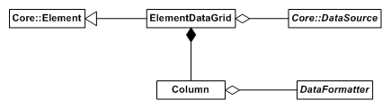
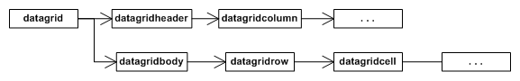

The Controls plugin includes the data grid element, an element capable of fetching, positioning and rendering dynamic tabulated data. Data grids read their content from data sources. The class Rocket::Controls::ElementDataGrid is the interface for data grid elements.

The following diagram summarises the interaction between the objects described below in the data grid system.



Note: an excellent way to learn how to use data grids and data sources is the [data grid tutorial](../../tutorials/datagrid.html). This shows you how to build up a data source and create a data grid to read from it.

### Data sources

Data sources are named database-like objects that store tables of data, each of which can be queried row by row. Each table contains several named columns of data per row. Listeners can attach to data sources to be notified when changes to the data occur. All data sources derive from the Rocket::Core::DataSource class. The constructor for the base class takes a unique string which is used to identify the data source. Concrete data sources must provide implementations for the pure virtual functions:

```cpp
// Fetches the contents of one row of a table within the data source.
// @param[out] row The list of values in the table.
// @param[in] table The name of the table to query.
// @param[in] row_index The index of the desired row.
// @param[in] columns The list of desired columns within the row.
virtual void GetRow(Rocket::Core::StringList& row,
                    const Rocket::Core::String& table,
                    int row_index,
                    const Rocket::Core::StringList& columns) = 0;

// Fetches the number of rows within one of this data source's tables.
// @param[in] table The name of the table to query.
// @return The number of rows within the specified table.
virtual int GetNumRows(const Rocket::Core::String& table) = 0;
```

GetRow() is called by the data grid when it needs to fetch the source's values. The parameters to the function are:

* row: A list of strings that the data source must write the row's contents to. Which columns of data are to be written, and in which order, is specified by the columns parameter.
* table: Which table within the data source the data grid is requesting data from. This is only important if a single data source object is supporting multiple tables.
* row_index: The zero-based index of the row the data source is requesting.
* columns: An ordered list of which columns the data grid wants the values for. 

GetNumRows() is called by the data grid when it needs to know how many entries a certain table within a data source is.

#### Notifying of changes

In order for an attached data grid to remain up-to-date, data sources need to inform their listeners when alterations occur to their data. There are several protected methods available to a data source for doing this:

```cpp
// Tells all attached listeners that one or more rows have been added/ to the data source.
// @param[in] table The name of the table to have rows added to it.
// @param[in] first_row_added The index of the first row added.
// @param[in] num_rows_added The number of rows added (including the first row).
void NotifyRowAdd(const Rocket::Core::String& table,
               int first_row_added,
               int num_rows_added);
```

The NotifyRowAdd() function informs an attached data grid that a number of rows have been inserted into one of the tables.

```cpp
// Tells all attached listeners that one or more rows have been removed from the data source.
// @param[in] table The name of the table to have rows removed from it.
// @param[in] first_row_removed The index of the first row removed.
// @param[in] num_rows_removed The number of rows removed (including the first row).
void NotifyRowRemove(const Rocket::Core::String& table,
                 int first_row_removed,
                 int num_rows_removed);
```

The NotifyRowRemove() function informs an attached data grid that a number of rows have been removed from one of the tables.

```cpp
// Tells all attached listeners that one or more rows have been changed in the data source.
// @param[in] table The name of the table to have rows changed in it.
// @param[in] first_row_changed The index of the first row changed.
// @param[in] num_rows_changed The number of rows changed (including the first row).
void NotifyRowChange(const Rocket::Core::String& table,
                 int first_row_changed,
                 int num_rows_changed);
```

The NotifyRowChange() function informs an attached data grid that a number of rows have changed from one of the tables.

```cpp
// Tells all attached listeners that the row structure has completely changed in the data source.
// @param[in] table The name of the table to have rows changed in it.
void NotifyRowChange(const Rocket::Core::String& table);
```

The simpler NotifyRowChange() function informs an attached data grid that one of the tables has completely changed or changed significantly. Use this function when the data set for a table changes entirely, or when many simultaneous individual changes occur that would otherwise cause many of the simpler RowsChanged() calls.

### Specifying a data grid

Data grids are specified in RML with the `<datagrid>` tag. The "source" attribute on the data grid specifies which data source object the grid will read from; this is the name of the desired data source and the table name within that data source separated by a dot ('.'). For example, the following data grid will query data from the "player_1" table within the "high_scores" data source:

```
<datagrid source="high_scores.player_1" />
```

The data source can be changed in C++ with the SetDataSource() function.

```cpp
// Sets a new data source for the contents of the data grid.
// @param[in] data_source_name The name of the new data source.
void SetDataSource(const Rocket::Core::String& data_source_name);
```

#### Adding columns

The only children allowed to a data grid element are column definitions, specified with the `<col>` tag. The column tag takes the following attributes:

* fields: A comma-separated list of the fields this column will read from the data grid's data source. This will populate the columns parameter to the GetRow() function.
* formatter: The name of the [data formatter](#data-formatters) used to convert the row data to actual RML. If this is invalid or not provided, then the raw row data is shown, separated by commas.
* width: The initial width of the column, in pixels. 

The RML content between the opening and closing column tags will form the header element. Columns can be added in C++ with the AddColumn() function.

```cpp
// Adds a column to the table.
// @param[in] fields A comma-separated list of fields that this column reads from the data source.
// @param[in] formatter The name of the data formatter to be used to format the raw column data into RML.
// @param[in] initial_width The initial width, in pixels, of the column.
// @param[in] header_rml The RML to use as the column header.
// @return True if the column was added successfully, false if not.
bool AddColumn(const Rocket::Core::String& fields,
               const Rocket::Core::String& formatter,
               float initial_width,
               const Rocket::Core::String& header_rml);
```

### Data formatters

Data formatters are used to format the raw result of a data source query (an ordered list of strings) into RML content suitable for display inside a data grid cell. A data formatter is a simple object that derives from Rocket::Controls::DataFormatter. The constructor takes a string that acts as the data formatters unique name. It does not need to be registered with anything; as long as it exists it can be queried by data grid columns by its name.

A concrete data formatter must implement the FormatData() function:

```cpp
// Formats the raw results of a data source request into RML.
// @param[out] formatted_data The formatted RML.
// @param[in] raw_data A list of the raw data fields.
virtual void FormatData(Rocket::Core::String& formatted_data,
                        const Rocket::Core::StringList& raw_data) = 0;
```

See the high scores tutorial for examples of creating data formatters.

### Applying properties

As you would imagine, data grids generate internal elements like they're going out of fashion. Below is a diagram of their internal layout.



The data grid element itself, tagged datagrid, has two direct children, datagridheader and datagridbody. The header element contains datagridcolumn elements, one for each column in the data grid. The body element contains all of the data rows, datagridrow elements. Each row contains datagridcell elements, one for each column in the datagrid. Both datagridcell and datagridcolumn elements contain arbitrary RML; in the column's case, the header RML for the column, in the cell's case, the RML generated from the data formatters.

Each of these elements can be specified in RCSS rules to easily style the different components of the data grid. 
