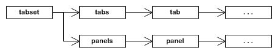

The Controls plugin comes with a tab set control for breaking up content over multiple tabbed panels. The control has a list of tabs which are always visible and can be clicked on to display their associated panel. Only one panel is visible at any one time.

You can find the RML documentation for the tab set element [here](../../rml/controls.html#tab-set-element).

Here is an RML sample demonstrating the declaration of a tab set:

```html
<rml>
	<head>
	</head>
	<body>
		<tabset>
			<tab>Tab 1</tab>
			<panel>
				Welcome to the first tab!
			</panel>
			<tab>Tab 2</tab>
			<panel>
				Welcome to the second tab!
			</panel>
		</tabset>
...
</rml>
```

The {{page.lib_ns}}::Controls::ElementTabSet class (found in {{page.lib_dir}}/Controls/ElementTabSet.h) defines the interface to tab set elements.

The function GetNumTabs() will return the number of panels within the tab set.

```cpp
// Retrieve the number of tabs in the tab set.
// @return The number of tabs.
int GetNumTabs();
```

### Setting tab content

Through C++, the contents of the panel tabs can be set to either unparsed RML or an existing element hierarchy.

```cpp
// Sets the specifed tab index's tab title RML.
// @param[in] tab_index The tab index to set. If it doesn't already exist, it will be created.
// @param[in] rml The RML to set on the tab title.
void SetTab(int tab_index, const {{page.lib_ns}}::Core::String& rml);

// Set the specifed tab index's title element.
// @param[in] tab_index The tab index to set. If it doesn't already exist, it will be created.
// @param[in] element The root of the element tree to set as the tab title.
void SetTab(int tab_index, {{page.lib_ns}}::Core::Element* element);
```

When the contents of a tab is set, it will replace whatever it had before. If you specify a tab index that doesn't exist, it will be created.

Note that these functions only set the content of the tab buttons, not the panels themselves.

### Setting panel content

Similarly to the panel tabs, the content of the panels themselves can be set to unparsed RML or an existing element.

```cpp
// Sets the specifed tab index's tab panel RML.
// @param[in] tab_index The tab index to set. If it doesn't already exist, it will be created.
// @param[in] rml The RML to set on the tab panel.
void SetPanel(int tab_index, const {{page.lib_ns}}::Core::String& rml);

// Set the specified tab index's body element.
// @param[in] tab_index The tab index to set. If it doesn't already exist, it will be created.
// @param[in] element The root of the element tree to set as the window.
void SetPanel(int tab_index, {{page.lib_ns}}::Core::Element* element);
```

### Removing panels

The RemoveTab() function will remove an existing tab and its panel from the tab set.

```cpp
// Remove one of the tab set's panels and its corresponding tab.
// @param[in] tab_index The tab index to remove. If no tab matches this index, nothing will be removed.
void RemoveTab(int tab_index);
```

### Applying properties

Tab sets and their elements can have properties applied on them like other elements, and will need to in order to be positioned correctly. By default, all tabs have their 'display' property set to 'inline-block', as required for a horizontal layout. If you want to change this behaviour, you will need to edit the tab creation code in ElementTabSet.cpp.

The diagram below details the internal hierarchy of the tab set.



The tab set element itself (tagged tabset) will have two child elements, panels, which holds all the panel elements, and tabs, which holds all the tab elements. Each of the panel and tab elements hold arbitrary RML content. A typical RCSS definition for a tab set would be follows:

```css
/* Force the tabset element to a fixed size. */
tabset
{
	display: block;
	width: 300px;
	height: 200px;
}

/* Display the tab container as a block element 20 pixels high; it will
   be positioned at the top of the tabset. */
tabset tabs
{
	display: block;
	height: 20px;
}

/* Force each tab to only take up 50 pixels across the tabs element. */
tabset tab
{
	width: 50px;
}

/* Display the panel container as a block element 180 pixels high; it will
   be positioned below the tab container and take up the rest of the space
   in the tabset. */
tabset panels
{
	display: block;
	height: 180px;
}

/* Fix each panel to take up exactly the panelled space. */
tabset panels panel
{
	display: block;
	width: 100%;
	height: 100%;
}
```

The order of the panels and tabs elements is determined by the RML order; if a panel element is encountered before a tab element, the panels element will be created first, and vice versa. This way, you can create a tab set with tabs on the bottom or top. 
