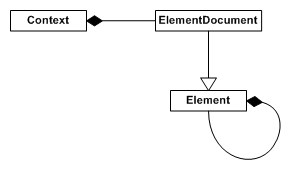
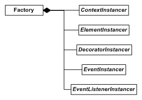

So you've got {{page.lib_name}} integrated into your application, but how are you meant to use it? This is an overview of the significant concepts and objects at the core of {{page.lib_name}}.

### Reference counting

Most {{page.lib_name}} objects are reference counted and derive from `{{page.lib_ns}}::Core::ReferenceCountable`. The functions `AddReference()` and `RemoveReference()` will add and remove a single reference respectively. Reference counted objects have an initial reference count of one. {{page.lib_name}} systems will add a reference to an object when the object enters their domain, and remove the reference when it leaves. When the reference count on an object drops to zero, it will be destroyed internally. It is important that you don't release objects yourself with the delete operator, except where required to in a custom [instancer](#the-factory-and-instancers).

When you create a reference counted object and give control of it to a {{page.lib_name}} system, it is important that you remove the initial reference so the object will be destroyed as appropriate.

### The element hierarchy

#### Element

An element, represented by a `{{page.lib_ns}}::Core::Element` object, is a single interface element, generally found within a document. When loading a document from an [RML](../rml.html) file, each RML tag will create a single element within the document.

An element is either rectangular in shape or consists of a series of rectangles. Elements are part of a hierarchy, each element having one parent and any number of ordered children. Each child may or may not be positioned within its parent element.

Elements have [RCSS](../rcss.html) properties assigned to them through the [style system](rcss.html). These properties determine the size, layout and graphical representation of the element, as well as any [decorators](decorators.html) on the element.

Elements send [events](events.html) when certain actions are performed on them. The application can subscribe to elements to be notified when an event occurs on that element. All elements send events for mouse actions (`hover`{:.evt}, `click`{:.evt}, `double-click`{:.evt}, etc) and when the input focus changes (`focus`{:.evt}, `blur`{:.evt}). Further events can be sent by derived elements.

The functionality of an element can be extended by deriving from the `{{page.lib_ns}}::Core::Element` class, (such as with the form elements in the [Controls plugin](controls.html)). Applications can derive their own custom elements.

If comparing {{page.lib_name}} to HTML, a {{page.lib_name}} element is analogous to a node within an HTML page.

#### Document

A document, represented by a `{{page.lib_ns}}::Core::ElementDocument` object, is an element itself, and the root of the element hierarchy for a document. A document generally exists within a context. Documents are layered within their context, and can be forced into a specific layer (ie, fixed to the background or foreground).

A {{page.lib_name}} document is analogous to an HTML page within a web browser.

#### Context

Each context, represented by a `{{page.lib_ns}}::Core::Context` object, is an independent collection of documents. Each context has its own size and maintains its own input state; this includes mouse cursor position, focus element and hovered elements. Contexts can be updated, rendered and provided with user input independently of each other at the application's discretion.

A {{page.lib_name}} context is analogous to a single desktop containing several HTML pages, each within their own window.

### Properties and style sheets

Properties are named attributes with a given range of values that are attached to elements. The specification of properties is defined by {{page.lib_name}}, although new properties can be defined by the application. Each element has a value attached to it for every available property; these values will be the property's default unless explicitly set. Properties influence layout, formatting and decoration of elements.

[Style sheets](rcss.html) contain groups of property declarations and rules to selectively apply these groups to elements within a document. Style sheets are typically contained in a separate file or declared inline in an RML file.

A RCSS property is analogous to a CSS property on an HTML element.

### Decorators

[Decorators](decorators.html) are objects designed to be attached to elements to render arbitrary effects. Several built-in decorators are included with {{page.lib_name}}, and applications can create their own by deriving from the decorator interface `{{page.lib_ns}}::Core::Decorator`. Decorator attachment and customisation is built into the property system.

### The factory and instancers

All of {{page.lib_name}}'s objects that are able to be customised (elements, documents, contexts, decorators, events and event listeners) are constructed through the factory `{{page.lib_ns}}::Core::Factory` with specific instancer types.

Instancers are abstract types that are capable of creating and destroying concrete {{page.lib_name}} objects. They are described throughout their documentation alongside their respective types. 
