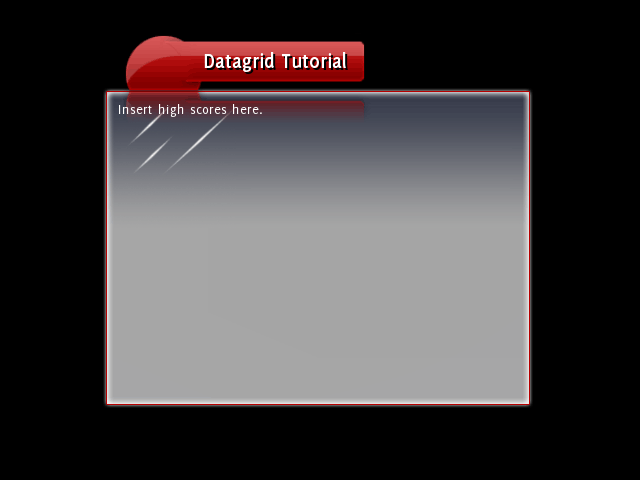
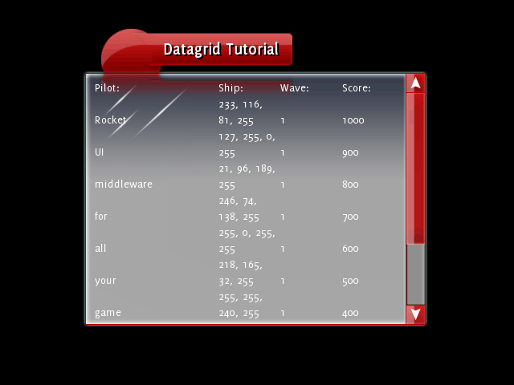
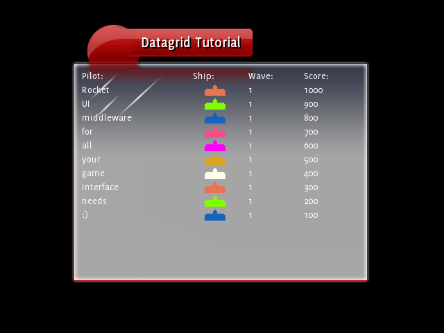
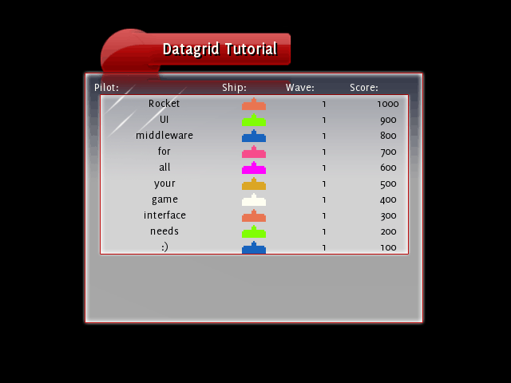
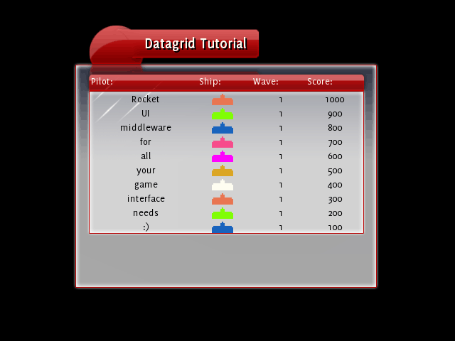
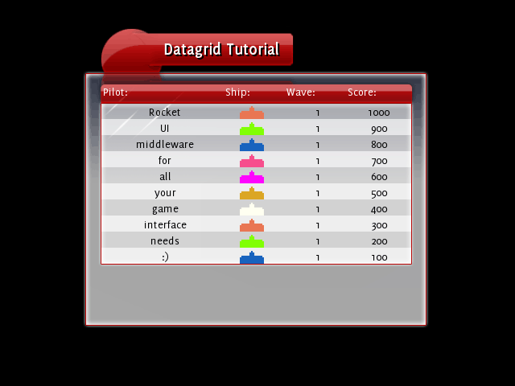

This tutorial will take you through the process of upgrading an existing body of data to be a data source, then creating a datagrid to read from that source.

This tutorial expects that you've got a solid grounding in C++ and know the basics of [RML](../rml.html) and [RCSS](../rcss.html).

For a detailed description on how DataGrids work with DataSources please see the [C++ Manual](../cpp_manual/controls/data_grid.html).

### Step 1: Getting started

Load up the Datagrid tutorial, compile and run it, you'll see a blank high scores window:



If you take a look at the C++ code, you see that there's a `HighScores` class that loads and stores a set of high scores. At the moment it doesn't do much at all - the next step will be to turn this into data source so it can talk with the datagrid that we're going to add later.

### Step 2: The data source

`{{page.lib_ns}}::Core::DataSource` is an abstract base class which simulates the interface to a database. Each data source contains one or more tables, and each table contains rows and columns. The columns specify the fields each row has. To inherit from `{{page.lib_ns}}::Core::DataSource`, you need to override two functions:

```cpp
virtual void GetRow({{page.lib_ns}}::Core::StringList& row, const {{page.lib_ns}}::Core::String& table, int row_index, const {{page.lib_ns}}::Core::StringList& columns) = 0;
virtual int GetNumRows(const {{page.lib_ns}}::Core::String& table) = 0;
```

`GetNumRows()` is the easy one - the function is passed in the name of a table, and it returns how many rows are currently in that table.

`GetRow()` is the meat of the data source implementation. It takes a table, an index to a row within that table and a list of columns that are being queried. The function must look that row up and, for each column in the list, push the data into the `{{page.lib_ns}}::Core::StringList` row.

#### Implementation

So, let's convert the lackluster `HighScores` class to a fully-fledged `{{page.lib_ns}}::Core::DataSource`. First of all include `{{page.lib_dir}}/Core/DataSource.h`{:.path} and have `HighScores` inherit from `{{page.lib_ns}}::Core::DataSource`. Take a quick look at the `{{page.lib_ns}}::Core::DataSource`'s constructor:

```cpp
{{page.lib_ns}}::Core::DataSource(const {{page.lib_ns}}::Core::String& name = "");
```

The name parameter that it takes is used to uniquely identify it. If this is set then we can use that name have a datagrid automatically look up our data source without any C++ code. If we don't pass in a name, then it'll default to the address of the data source object - much less useful! So it's best to call the constructor from `HighScores`' own constructor and pass in a name, like "high_scores". When we instance the DataSource it'll automatically add itself to the source database and be accessable from anywhere.

That's the basics covered, now we need to implement the two required functions. Add the `GetRow()` and `GetNumRows()` functions into `HighScores`. The implementation of these is fairly simple: `GetNumRows()` returns the number of high scores we've got in the chart, and GetRow loops through the columns array and constructs a string for each requested column and pushes it into the passed-in string list. So you should end up with something like this:

```cpp
void HighScores::GetRow({{page.lib_ns}}::Core::StringList& row, const {{page.lib_ns}}::Core::String& table, int row_index, const {{page.lib_ns}}::Core::StringList& columns)
{
	if (table == "scores")
	{
		for (size_t i = 0; i < columns.size(); i++)
		{
			if (columns[i] == "name")
			{
				row.push_back(scores[row_index].name);
			}
			else if (columns[i] == "score")
			{
				row.push_back({{page.lib_ns}}::Core::String(32, "%d", scores[row_index].score));
			}
			else if (columns[i] == "colour")
			{
				{{page.lib_ns}}::Core::String colour_string;
				{{page.lib_ns}}::Core::TypeConverter< {{page.lib_ns}}::Core::Colourb, {{page.lib_ns}}::Core::String >::Convert(scores[row_index].colour, colour_string);
				row.push_back(colour_string);
			}
			else if (columns[i] == "wave")
			{
				row.push_back({{page.lib_ns}}::Core::String(8, "%d", scores[row_index].wave));
			}
		}
	}
}

int HighScores::GetNumRows(const {{page.lib_ns}}::Core::String& table)
{
	if (table == "scores")
	{
		for (int i = 0; i < NUM_SCORES; i++)
		{
			if (scores[i].score == -1)
			{
				return i;
			}
		}

		return NUM_SCORES;
	}

	return 0;
}
```

This should leave you with a compiling HighScores now that all the pure virtual functions have been implemented, and a data source that is perfectly usable. One more step remains however:

#### Updating the data source

Half of the point of having data sources is allowing them to update dynamically - it's not much fun if the data can't change after it's been displayed by the datagrid. So `{{page.lib_ns}}::Core::DataSource` has a few protected functions that you can call to let it know that something's changed inside the source:

```cpp
// Tells all attached listeners that one or more rows have been added to the data source.
void NotifyRowAdd(const String& table, int first_row_added, int num_rows_added);

// Tells all attached listeners that one or more rows have been removed from the data source.
void NotifyRowRemove(const String& table, int first_row_removed, int num_rows_removed);

// Tells all attached listeners that one or more rows have been changed in the data source.
void NotifyRowChange(const String& table, int first_row_changed, int num_rows_changed);

// Tells all attached listeners that the row structure has completely changed in the data source.
void NotifyRowChange(const String& table);
```

The first two are self-explanatory - call them after you've added or removed rows. The first `RowsChanged()` function is to be called when you've altered some cell information in some rows, and the datagrid will refresh the contents of those rows. The second `RowsChanged()` function should be called when everything in the data source has changed (or you don't know what's changed) - this will cause any attached datagrids to wipe their contents and start again.

So, out of a sense of completeness, we should add in a call to `NotifyRowAdd()` whenever we add a row. We'd do the same if we removed or changed rows, but in this sample we just add rows. Check out the HighScores chart in _Rocket Invaders from Mars_ to see how `NotifyRowChange()` is used when the player enters their name. Anyway, here's the final `SubmitScore()` function:

```cpp
void HighScores::SubmitScore(const {{page.lib_ns}}::Core::String& name, const {{page.lib_ns}}::Core::Colourb& colour, int wave, int score)
{
	for (size_t i = 0; i < NUM_SCORES; i++)
	{
		if (score > scores[i].score)
		{
			// If we've already got the maximum number of scores, then we have
			// to send a RowsRemoved message as we're going to delete the last
			// row from the data source.
			bool max_rows = scores[NUM_SCORES - 1].score != -1;

			// Push down all the other scores.
			for (int j = NUM_SCORES - 1; j > i; j--)
			{
				scores[j] = scores[j - 1];
			}

			// Insert our new score.
			scores[i].name = name;
			scores[i].colour = colour;
			scores[i].wave = wave;
			scores[i].score = score;

			// Send the row removal message (if necessary).
			if (max_rows)
			{
				NotifyRowRemove("scores", NUM_SCORES - 1, 1);
			}

			// Then send the rows added message.
			NotifyRowAdd("scores", i, 1);

			return;
		}
	}
}
```

### Step 3: The datagrid

Now on to the datagrid. To create one of these we make a {{page.lib_name}} element with the tag `<datagrid>`{:.tag}. Inside the datagrid we can define multiple `<col>`{:.tag}s - each `<col>`{:.tag} being a column in the grid. This is what it might look like:

```html
<datagrid source="high_scores.scores">
	<col fields="name" width="40%">Pilot:</col>
	<col fields="colour" width="20%">Ship:</col>
	<col fields="wave" width="20%">Wave:</col>
	<col fields="score" width="20%">Score:</col>
</datagrid>
```

The source attribute in the datagrid tag tells the datagrid where to fetch its data from. This is the in the format `datasource.table`{:.value} - so this looks in the `scores`{:.value} table, found in the `high_scores`{:.value} data source. If you called your data source a different name then change this attribute.

Each column has a `fields`{:.attr} attribute - this tells the column which fields it fetches from the data source to display. This is a list in CSV form, but in this tutorial each column only fetches one field. In the _Rocket Invaders from Mars_ sample multiple fields per column are used.

The `width`{:.attr} attribute in `<col>`{:.tag} instructs how much of the width of the datagrid that this column takes up.

Anything in between the `<col>`{:.tag} and `</col>`{:.tag} tags is put in a header row, above all the other rows. Any RML can be put in here, and it can be left empty.

Running the sample with the above code will give us the following output:



Well, at least it's working. Time to pretty it up some:

#### Data formatters

The third part of the datagrid system is the data formatter. A data formatter sits in between the data source and datagrid - it takes the raw field information and processes it into RML. So in this way you can turn the text returned by a column request into an icon, a button, an image with a caption, anything at all. Even another datagrid! To do this, first we go to the declaration of the datagrid in tutorial.rml and add the data formatter attribute to the ship col:

```html
<col fields="colour" formatter="ship" width="20%">Ship:</col>
```

This will tell the ship column to not just display the raw RGBA values that get sent back from the HighScore data source, but instead to send them to the `ship`{:.value} formatter and display what that returns. Easy as that! Now all we have to do is write the ship formatter.

A data formatter inherits from the class {{page.lib_ns}}::Controls::DataFormatter. It has one function that needs overriding:

```cpp
virtual void FormatData({{page.lib_ns}}::Core::String& formatted_data, const {{page.lib_ns}}::Core::StringList& raw_data) = 0;
```

This function takes a list of strings, which contains the fields from the data query. The string reference is used to return the final RML once the data has been formatted. It also has a constructor that takes a `const char*` (defaulting to `""`{:.value}) in the same way as `{{page.lib_ns}}::Core::DataSource`. This is the name of the formatter, and is used to uniquely identify it to any datagrid columns that wish to use it.

So to make a new formatter, first make a new class - I called mine `HighScoresShipFormatter`. Have it inherit from `{{page.lib_ns}}::Controls::DataFormatter` and define the `FormatData()` function. In the .cpp file, call the `{{page.lib_ns}}::Controls::DataFormatter` constructor called from the `HighScoresShipFormatter` constructor with the parameter `ship`{:.value}. This will give it the name that the datagrid column references it by. The next step is to write the FormatData function. Very handily there's a decorator which does exactly what we want, and it's mapped to the `<defender>`{:.tag} tag. The decorator reads the "colour" style applied to the `<defender>`{:.tag} tag and colours itself based on that. So all we have to do is read the raw colour information then construct a `<defender>`{:.tag} tag with a style with that colour. Here's my implementation:

```cpp
void HighScoresShipFormatter::FormatData({{page.lib_ns}}::Core::String& formatted_data, const {{page.lib_ns}}::Core::StringList& raw_data)
{
	{{page.lib_ns}}::Core::Colourb ship_colour;
	{{page.lib_ns}}::Core::TypeConverter< {{page.lib_ns}}::Core::String, {{page.lib_ns}}::Core::Colourb >::Convert(raw_data[0], ship_colour);

	{{page.lib_ns}}::Core::String colour_string(32, "%d,%d,%d", ship_colour.red, ship_colour.green, ship_colour.blue);
	formatted_data = "<defender style=\"color: rgb(" + colour_string + ");\" />";
}
```

Be sure to include `<{{page.lib_dir}}/Core/TypeConverter.h>`{:.incl} at the top of your .cpp file.

Then to tie it all together we need to instance the formatter. It'll automatically add itself to the formatter database, so in `main.cpp`{:.path} we only have to include the .h file and construct an instance after {{page.lib_name}} is initialised.

So your class should look something like this:

```cpp
#include <{{page.lib_dir}}/Controls/DataFormatter.h>

class HighScoresShipFormatter : public {{page.lib_ns}}::Controls::DataFormatter
{
	public:
		HighScoresShipFormatter();
		~HighScoresShipFormatter();

		void FormatData({{page.lib_ns}}::Core::String& formatted_data, const {{page.lib_ns}}::Core::StringList& raw_data);
};

#include "HighScoresShipFormatter.h"
#include <{{page.lib_dir}}/Core/TypeConverter.h>

HighScoresShipFormatter::HighScoresShipFormatter() : {{page.lib_ns}}::Controls::DataFormatter("ship")
{
}

HighScoresShipFormatter::~HighScoresShipFormatter()
{
}

void HighScoresShipFormatter::FormatData({{page.lib_ns}}::Core::String& formatted_data, const {{page.lib_ns}}::Core::StringList& raw_data)
{
	// Data format:
	// raw_data[0] is the colour, in "%d, %d, %d, %d" format.

	{{page.lib_ns}}::Core::Colourb ship_colour;
	{{page.lib_ns}}::Core::TypeConverter< {{page.lib_ns}}::Core::String, {{page.lib_ns}}::Core::Colourb >::Convert(raw_data[0], ship_colour);

	{{page.lib_ns}}::Core::String colour_string(32, "%d,%d,%d", ship_colour.red, ship_colour.green, ship_colour.blue);

	formatted_data = "<defender style=\"color: rgb(" + colour_string + ");\" />";
}
```

Run that and you should now see the correctly formatted ship colours:



Excellent! Now to style the rest of the table.

### Step 4: Styling the datagrid

The datagrid can be styled just like any other {{page.lib_name}} element. RCSS hooks are provided for:

* `datagrid`{:.tag}: The whole grid, including the header and all the visible rows.
* `datagridheader`{:.tag}: The top row that contains the headers for each of the columns.
* `datagridbody`{:.tag}: All the rows, excluding the header row.
* `datagridrow`{:.tag}: Each row underneath the header.
* `datagridcell`{:.tag}: Each cell inside a row. 


So, using these hooks, we can make the datagrid look pretty much any way we want it to. First, let's add a background to the body. The RCSS rule shown below will add an image background (using a tiled-box decorator) around the body, change the text to black and center it, and finally add some margins and padding to move the text within the new border:

```css
datagridbody
{
	color: black;
	text-align: center;
			
	margin-left: 4px;
	margin-right: 3px;
	padding: 0px 4px 4px 4px;
			
	background-decorator: tiled-box;
	background-top-left-image: ../../../assets/invader.png 281px 275px 292px 284px;
	background-top-right-image: ../../../assets/invader.png 294px 275px 305px 284px;
	background-top-image: ../../../assets/invader.png stretch 292px 275px 293px 284px;
	background-bottom-left-image: ../../../assets/invader.png 281px 285px 292px 296px;
	background-bottom-right-image: ../../../assets/invader.png 294px 285px 305px 296px;
	background-bottom-image: ../../../assets/invader.png stretch 292px 285px 293px 296px;
	background-left-image: ../../../assets/invader.png stretch 281px 283px 292px 284px;
	background-center-image: ../../../assets/invader.png stretch 292px 283px 293px 284px;
}
```

So now it should look like this:



Much better! Header still is a bit lacking. We'll add a rule to add a tiled-horizontal decorator as a background, then some padding to bring the text inside the background:

```css
datagridheader
{
	width: auto;
	height: 25px;
	padding: 5px 10px 0px 10px;
		
	background-decorator: tiled-horizontal;
	background-left-image: ../../../assets/invader.png 127px 192px 143px 223px;
	background-center-image: ../../../assets/invader.png stretch 143px 192px 145px 223px;
	background-right-image: ../../../assets/invader.png 145px 192px 160px 223px;
}
```

So now we've got the following:



Looking pretty good now. One more thing to add a bit more zing: we'll colour the even rows differently to make it easier to see the row delineations. The following rule will do exactly that:

```css
datagrid datagridrow:nth-child(even)
{
	background: #FFFFFFA0;
}
```

So finally, this is what we've come up with:


