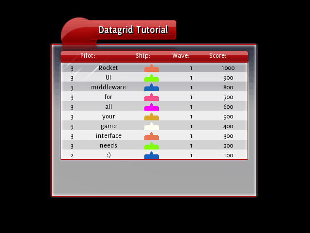

This tutorial expects that you've got a solid grounding in C++ and know the basics of [RML](../rml.html) and [RCSS](../rcss.html), and know the basics of datagrids (ie, completed the first [datagrid tutorial](datagrid.html).)

### Step 1: The Plan

So we've got a pretty nice high scores chart, but we want to add some pep. One way to do that would be to show how many of each type of alien each person on the chart has destroyed. If we had this much information for everyone shown all the time there we would get info overload, so we'll develop it so the user can expand each row of the chart and see the kills that way.

#### Tree structure

Each row in a datagrid has the ability to possess child rows - each of which can also have child rows, and so on. This is specified by the data source returning the name of the data source and table that the row fetches its children from - in the same way that a datagrid definition specifies the data source and table to fetch the root rows from.

A row's child rows are displayed directly underneath the row itself. By default a row starts with its child rows hidden, so you'll only see the top level rows when you view a datagrid for the first time. Fortunately there are a few tools that you can use to automatically add tree functionality to your datagrid. More on these later - next, let's look at the changes we've made to the existing datagrid tutorial:

#### The revised HighScores

Take a look at the HighScores class and see its changes from the first datagrid tutorial. The changes to the definition are the addition of the `NUM_ALIEN_TYPES` variable and the addition of the alien_kills variable to the `SubmitScore()` function and the Score struct:

```cpp
const int NUM_ALIEN_TYPES = 3;

...

void SubmitScore(const {{page.lib_ns}}::Core::String& name, const {{page.lib_ns}}::Core::Colourb& colour, int wave, int score, int alien_kills[]);

...

struct Score
{
	{{page.lib_ns}}::Core::String name;
	{{page.lib_ns}}::Core::Colourb colour;
	int score;
	int wave;

	int alien_kills[NUM_ALIEN_TYPES];
};
```

The alien_kills array stores how many of each type of alien the player killed to get his score. This is what we'll be basing the new part of the chart from. The cpp file contains changes to the `SubmitScore()` and `LoadScores()` function to reflect the new data on the alien kills.

### Step 2: Improving the Data Source

#### Specifying the child data source

So first of all we need to make the data source aware of the child rows. The best way to do this is to add more tables to the `HighScores` data source: one table for each row. So in the `GetRow()` function, when we're checking what the columns are, we need to add one more check in - the check for the child data source. I added this code in after the "wave" check:

```cpp
else if (columns[i] == {{page.lib_ns}}::Core::DataSource::CHILD_SOURCE)
{
	row.push_back({{page.lib_ns}}::Core::String(24, "high_scores.player_%d", row_index));
}
```

This tells the calling datagrid that this row's child data source is `high_scores`{:.value} (the same source that we're editing) and the table is called `player_X`{:.value}. So now at the top of the `GetRow()` and `GetNumRows()` functions we now have to check for that table as well.

You may be wondering where the `{{page.lib_ns}}::Core::DataSource::CHILD_SOURCE` variable came from! It's one of three predefined variables that can be used as column names and in the fields attribute in the col definition. The other two are `DEPTH` and `NUM_CHILDREN`. `DEPTH` returns the depth of the row and can be used by data formatters to draw something different for each row. `NUM_CHILDREN` returns the number of children under each row, and is most often used to know when to draw a '+' button to expand the row. We'll be using `NUM_CHILDREN` later.

#### Adding the player tables

So now we need to add the extra tables into the data source. This can be done by adding an else statement in the `GetRow()` and `GetNumRows()` functions to catch all calls to tables that aren't `scores`{:.value}, then reading off the name which row it is exactly that's being queried.

```cpp
else
{
	int player_index;
	if (sscanf(table.CString(), "player_%d", &player_index) == 1)
	{
		// Code goes in here.
	}
}
```

For the `GetNumRows()` function I wanted it only to return the number of alien types with actual kills, so if the player hasn't killed any of a certain type then we don't return that. Then is the code I ended up with:

```cpp
int player_index;
if (sscanf(table.CString(), "player_%d", &player_index) == 1)
{
	int num_alien_types = 0;
	for (int i = 0; i < NUM_ALIEN_TYPES; i++)
	{
		if (scores[player_index].alien_kills[i] > 0)
		{
			num_alien_types++;
		}
	}
	return num_alien_types;
}
```

The `GetRows()` function is, of course, a bit more complicated. In the `name`{:.value} column we want it to display the name of the alien vessel. In the `score`{:.value} column we can put the score of the alien that was destroyed. Under the `colour`{:.value} column we'll want to display the image of the bad guy - we can upgrade the defender decorator to handle this. And finally the "wave" column will show how many of the little blighters the player managed to frag. Here's my code:

```cpp
else
{
	int player_index;
	if (sscanf(table.CString(), "player_%d", &player_index) == 1)
	{
		// Translate the row_index to the actual index into the alien_kills array - as there might be gaps in the
		// array we may have to skip those entries.
		int alien_kills_array_index = row_index;
		for (int i = 0; i < NUM_ALIEN_TYPES && i <= alien_kills_array_index; i++)
		{
			if (scores[row_index].alien_kills[i] == 0)
				alien_kills_array_index++;
		}

		for (size_t i = 0; i < columns.size(); i++)
		{
			if (columns[i] == "name")
			{
				row.push_back(ALIEN_NAMES[row_index]);
			}
			else if (columns[i] == "score")
			{
				row.push_back({{page.lib_ns}}::Core::String(8, "%d", ALIEN_SCORES[row_index]));
			}
			else if (columns[i] == "colour")
			{
				{{page.lib_ns}}::Core::String colour_string;
				{{page.lib_ns}}::Core::TypeConverter< {{page.lib_ns}}::Core::Colourb, {{page.lib_ns}}::Core::String >::Convert({{page.lib_ns}}::Core::Colourb(255, 255, 255), colour_string);
				row.push_back(colour_string);
			}
			else if (columns[i] == "wave")
			{
				int num_kills = scores[player_index].alien_kills[alien_kills_array_index];
				if (num_kills == 1)
					row.push_back({{page.lib_ns}}::Core::String("1 kill"));
				else
					row.push_back({{page.lib_ns}}::Core::String(16, "%d kills", num_kills));
			}
		}
	}
}
```

Run this and you should see: nothing different. All the rows are there, just hidden away, and we've no way to expand the rows!

### Step 3 : Adding the expand button

We need to make a new column in the datagrid, and into that column add a button if the row has any child rows.

#### Adding the column

Open the tutorial.rml file in the data folder, and look at where the datagrid is defined. We have to squeeze an extra col element in there. We won't give this column a title, and it'll have a formatter to create the button we need. The only bit of information that the formatter needs is how many child rows the row has - if it has 0 children then we don't create a button, 1 or more children then we do create it. So it should look something like this:

```html
<datagrid source="high_scores.scores">
	<col fields="#num_children" formatter="expand_button" width="10%"></col>
	<col fields="name" width="30%">Pilot:</col>
	<col fields="colour" formatter="ship" width="20%">Ship:</col>
	<col fields="wave" width="20%">Wave:</col>
	<col fields="score" width="20%">Score:</col>
</datagrid>
```

Of course we've no formatter called `expand_button`{:.value}, we'll have to create that later. The `#num_children`{:.value} field corresponds to the `{{page.lib_ns}}::Core::DataSource::NUM_CHILDREN` string - we use this to ask the data source about its number of children. I took 10% width out of the Pilot column to make room. So, fire this up and see what we get:



As you can see, we haven't got our `expand_button`{:.value} formatter yet so it falls back to displaying the raw text output, in this case the number of children.

#### Creating the data formatter

Naturally, the next step is to create the data formatter! This one is pretty simple - all it does it read the first entry of the raw_data array to see how many children there are. If there is at least one child, then we return a `<datagridexpand>`{:.tag} element, otherwise we return nothing:

```cpp
void ExpandButtonFormatter::FormatData({{page.lib_ns}}::Core::String& formatted_data, const {{page.lib_ns}}::Core::StringList& raw_data)
{
	// Data format:
	// raw_data[0] is the number of children that this row has. 0 means no button, more than 0 mean a button.

	int num_children = 0;
	{{page.lib_ns}}::Core::TypeConverter< {{page.lib_ns}}::Core::String, int >::Convert(raw_data[0], num_children);
	
	if (num_children > 0)
	{
		formatted_data = "<datagridexpand />";
	}
	else
	{
		formatted_data = "";
	}
}
```

The `<datagridexpand>`{:.tag} element is an element that listens to the `click`{:.evt} events and toggles the visibility of the child rows of its parent row. In the RML there's been styling added to make it look like a +/- button - you'll have to style one yourself just like a button if you plan on using trees in your own application.

Don't forget to call the formatter the right name, and to instance the formatter in `main.cpp`{:.path}. Once that's done, fire it up and you'll see the expand buttons beside each row, and be able to expand the child rows:

### Step 4: Styling

All that remains is upgrading the defender decorator to support displaying different images. The project's already been set up in a way so that if we give the defender element the classes of `alien_1`{:.cls}, `alien_2`{:.cls} or `alien_3`{:.cls} then it'll display with the image of that alien instead of the defender. We should probably rename that element too, as it's a bit of misnomer now, but we'll leave that till later. :) If we make a new field - type - and pass that into the defender decorator as well, we can get then defender to allocate the right class to get it to display the corresponding image. So, in `tutorial.rml`{:.path}:

```html
<col fields="colour,type" formatter="ship" width="20%">Ship:</col>
```

And in the GetRow function in `HighScores.cpp`{:.path}, for the `scores`{:.value} table, right after the "colour" check:

```cpp
else if (columns[i] == "type")
{
	row.push_back("0");
}
```

And in the same function, for the `player_X`{:.value} table:

```cpp
else if (columns[i] == "type")
{
	row.push_back({{page.lib_ns}}::Core::String(8, "%d", alien_kills_array_index + 1));
}
```

And then finally the formatter needs updating to use the new field we're sending through to it:

```cpp
void HighScoresShipFormatter::FormatData({{page.lib_ns}}::Core::String& formatted_data, const {{page.lib_ns}}::Core::StringList& raw_data)
{
	// Data format:
	// raw_data[0] is the colour, in "%d, %d, %d, %d" format.
	// raw_data[1] is the type. 0 means a defender, else N means alien type N.

	{{page.lib_ns}}::Core::Colourb ship_colour;
	{{page.lib_ns}}::Core::TypeConverter< {{page.lib_ns}}::Core::String, {{page.lib_ns}}::Core::Colourb >::Convert(raw_data[0], ship_colour);
	{{page.lib_ns}}::Core::String colour_string(32, "%d,%d,%d", ship_colour.red, ship_colour.green, ship_colour.blue);

	int ship_type;
	{{page.lib_ns}}::Core::TypeConverter< {{page.lib_ns}}::Core::String, int >::Convert(raw_data[1], ship_type);
	{{page.lib_ns}}::Core::String class_string = "";
	if (ship_type > 0)
	{
		class_string = {{page.lib_ns}}::Core::String(32, "class=\"alien_%d\"", ship_type);
	}

	formatted_data = "<defender " + class_string + " style=\"color: rgb(" + colour_string + ");\" />";
}
```

Which gives us the following:


