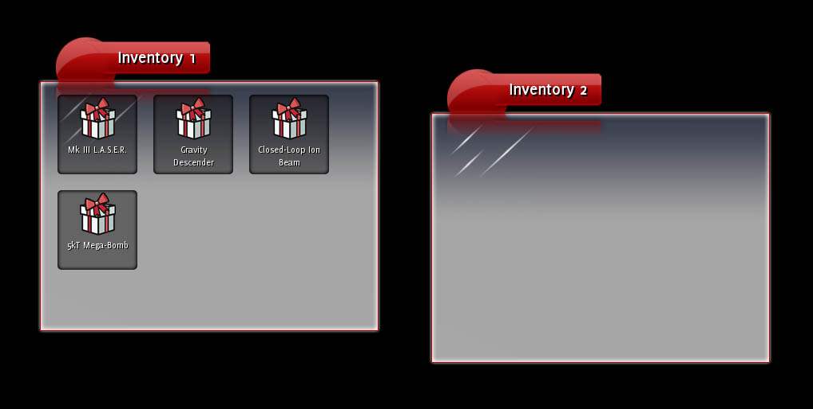
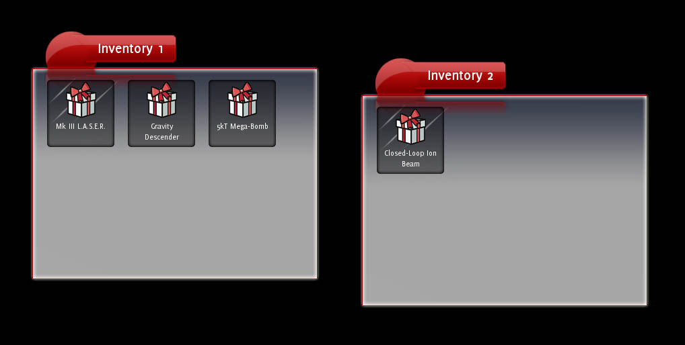

{{page.lib_name}} has a few ways of implementing dragging of elements, such as:

* the `<handle>`{:.tag} tag, as used by the documents in the sample applications
* setting an element's `drag`{:.prop} property to `drag`{:.value} or `drag-drop`{:.value} and listening to the raw drag events (`dragstart`{:.evt}, `dragend`{:.evt}, etc) and animating element positions manually
* setting an element's `drag`{:.prop} property to `clone`{:.value}

This tutorial shows how to use the third type, cloning, to implement dragging items between multiple inventory windows.

### Step 1: Taking a look

Compile the drag tutorial (at `/Samples/tutorial/tutorial_drag/`{:.path}) and run the program; it should end up looking like this:



Take a look at the source code. As you can see, the application creates two Inventory objects, each of which loads a document from the `inventory.rml`{:.path} file. The application then creates four inventory objects in one of the inventories; each of these objects is a {{page.lib_name}} element with a tag of `icon`{:.tag}. At the bottom of the `tutorial.rcss`{:.path} file you can see the properties applied to `icon`{:.tag}. It is sized to 100px x 100px with a margin to separate it from its neighbour icons and a decorator for its background image. It is floated left so icons will stack from left to right in the inventory windows.

### Step 2: Adding a drag property

If you try dragging the icons now, nothing much happens. In the tutorial's, RCSS file add the line:

```
	drag: clone;
```

to the rule for `icon`{:.tag} elements. Now try dragging the icons again; success! A clone of the icons now follows the cursor when you drag them around. We'll need to add code to listen to the end of the drag and respond accordingly, but before we get to that I'll explain how the `drag`{:.prop} property works.

The `drag`{:.prop} property can take several different values depending on how you want {{page.lib_name}} to inform you about dragging. The possible values are:

* `none`{:.value}: The element does not send any drag messages. This is the default.
* `block`{:.value}: The element does not send any drag messages, and prevents any elements 'underneath' the element from being dragged as well. This is useful for buttons on a window's title bar, for example.
* `drag`{:.value}: If the left mouse button is pressed while over the element and dragged, the element will trigger a `dragstart`{:.evt} event. Every subsequent time the mouse is moved, the element will trigger a `drag`{:.evt} event. When the button is released, the element will trigger a `dragend`{:.evt} event.
* `drag-drop`{:.value}: As drag, but as the mouse moves over other elements `dragover`{:.evt} and `dragout`{:.evt} events will be triggered (similarly to the `mouseover`{:.evt} and `mouseout`{:.evt} events). When the button is released, the element the mouse is hovering over will trigger the `dragdrop`{:.evt} message.
* `clone`{:.value}: As `drag-drop`{:.value}, but a clone of the element is attached to the mouse cursor during dragging. The clone has the pseudo-class `drag`{:.cls} set on it to allow it to be differentiated from the original element. 

So both `drag`{:.value} and `drag-drop`{:.value} only send messages; they don't actually drag any elements anywhere automatically. Very useful for complicated dragging operations or dragging multiple elements.

The clone value, however, takes care of almost everything if all you need to do is drag single elements.

### Step 3: Listening to the events

Now that the items can be visibly dragged around, we need to actually change their parenting when they're dropped. Create a class which inherits from `{{page.lib_ns}}::Core::EventListener` and give it a static method for registering the containers. Override the `ProcessEvent()` function as well so we can process the `dragdrop`{:.evt} event.

```cpp
#ifndef DRAGLISTENER_H
#define DRAGLISTENER_H

#include <{{page.lib_dir}}/Core/EventListener.h>
#include <{{page.lib_dir}}/Core/Types.h>

class DragListener : public {{page.lib_ns}}::Core::EventListener
{
public:
	/// Registers an elemenet as being a container of draggable elements.
	static void RegisterDraggableContainer({{page.lib_ns}}::Core::Element* element);

protected:
	virtual void ProcessEvent({{page.lib_ns}}::Core::Event& event);
};

#endif
```

The `RegisterDraggableContainer()` function simply needs to attach the listener object to the `dragdrop` event:

```cpp
#include "DragListener.h"
#include <{{page.lib_dir}}/Core/Element.h>

static DragListener drag_listener;

// Registers an element as being a container of draggable elements.
void DragListener::RegisterDraggableContainer({{page.lib_ns}}::Core::Element* element)
{
	element->AddEventListener("dragdrop", &drag_listener);
}
```

The `DragListener` object will now receive a call to `ProcessEvent()` whenever an item is dropped on the registered elements or any of their children.

#### The 'dragdrop' event

The event we'll be processing is the `dragdrop`{:.evt} event. This event is sent to the element that the dragged element was dropped onto. The dragged element itself can be queried from the event as the parameter `drag_element`{:.prop}.

We can now write a simple handler that will move dragged elements between the two containers:

```cpp
void DragListener::ProcessEvent({{page.lib_ns}}::Core::Event& event)
{
	if (event == "dragdrop")
	{
		{{page.lib_ns}}::Core::Element* dest_container = event.GetCurrentElement();
		{{page.lib_ns}}::Core::Element* drag_element = static_cast< {{page.lib_ns}}::Core::Element* >(event.GetParameter< void* >("drag_element", NULL));

		drag_element->GetParentNode()->RemoveChild(drag_element);
		dest_container->AppendChild(drag_element);
	}
}
```

The dragged element is simply removed from its old parent and attached to the container it was dropped onto.

#### Registering the containers

All that's left to do before we can try out the dragging is to register the containers. In the constructor of the Inventory object (top of Inventory.cpp), we need to register the inventory window as a draggable container; add the following line at the end of the constructor:

```cpp
	DragListener::RegisterDraggableContainer(document->GetElementById("content"));
```

Fire it up, start dragging and see what happens.



Success!

### Step 4: Sorting

Currently, regardless of where you drag an item to it will end up as the last item in the window. It would be great if you could sort the items within a window by dragging them on top of each other. To do this, the `ProcessEvent()` function will need to determine both the container and the item within that container an element was dragged onto.

Easy! We've attached as a `dragdrop`{:.evt} listener to the item containers. This means we'll be notified whenever the `dragdrop`{:.evt} event is sent to the containers or any of their children (i.e., their items). Each event has a target element and a current element. The target element is the element the event was actually targetted at; in the case of `dragdrop`{:.evt}, the element that was dropped on. The current element is the element the processing listener is observing; in our case, the container.

So we can find the destination item and container with the following:

```cpp
void DragListener::ProcessEvent({{page.lib_ns}}::Core::Event& event)
{
	if (event == "dragdrop")
	{
		{{page.lib_ns}}::Core::Element* dest_container = event.GetCurrentElement();
		{{page.lib_ns}}::Core::Element* dest_element = event.GetTargetElement();
		{{page.lib_ns}}::Core::Element* drag_element = static_cast< {{page.lib_ns}}::Core::Element* >(event.GetParameter< void* >("drag_element", NULL));
```

If the dragged item is dropped directly onto a container, then the current and target elements will be the same. In this case, we want to keep the old processing:

```cpp
		if (dest_container == dest_element)
		{
			// The dragged element was dragged directly onto a container.
			drag_element->GetParentNode()->RemoveChild(drag_element);
			dest_container->AppendChild(drag_element);
		}
```

Otherwise, we want to insert the item into its new container before the item it was dragged onto.

```cpp
		else
		{
			// The dragged element was dragged onto an item inside a container. In order to get the
			// element in the right place, it will be inserted into the container before the item
			// it was dragged on top of.
			{{page.lib_ns}}::Core::Element* insert_before = dest_element;

			drag_element->GetParentNode()->RemoveChild(drag_element);
			dest_container->InsertBefore(drag_element, insert_before);
		}
```

Run the app again and try it out. All good, except try dragging an item onto another item within the same window; in this case, it should be inserted after the element it is dragged onto, not before. So, just fix that up in the event handler and you're done!

You can find the fully-completed source in the drag sample. 
