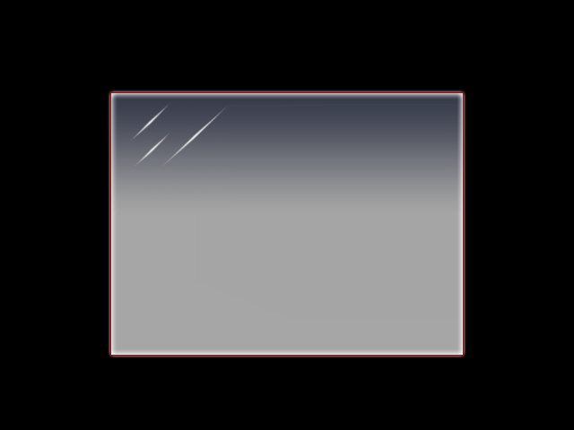
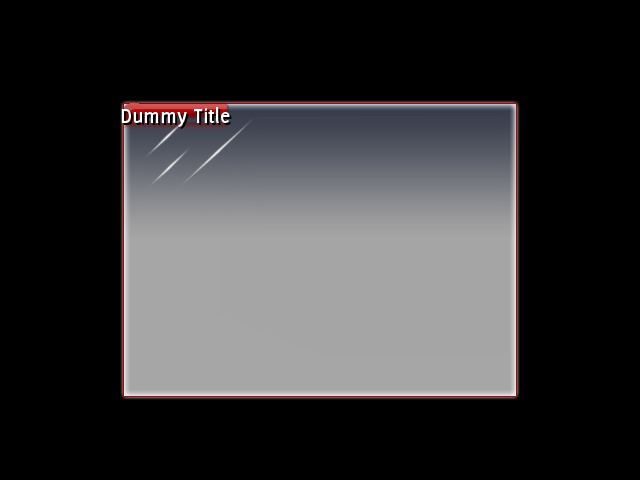
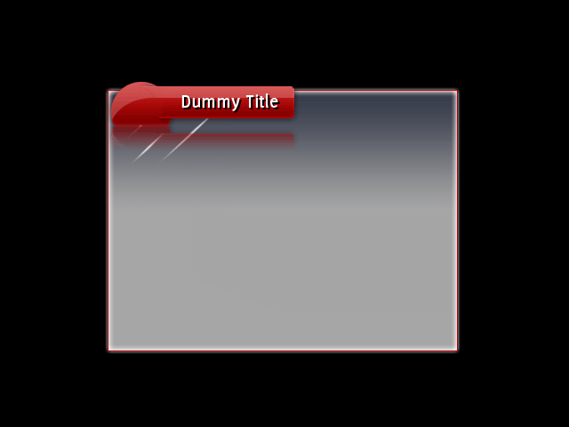
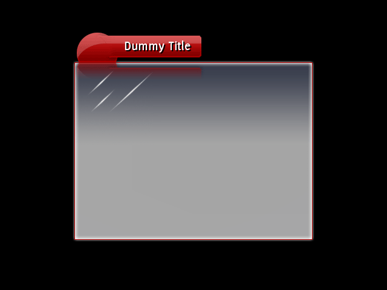
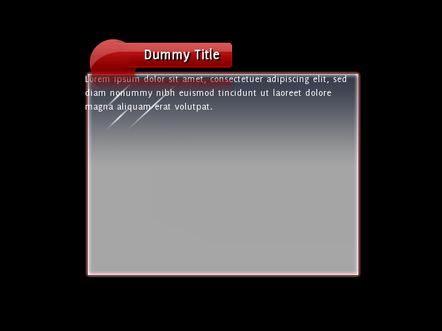
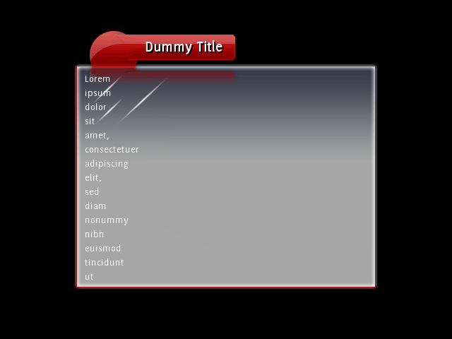
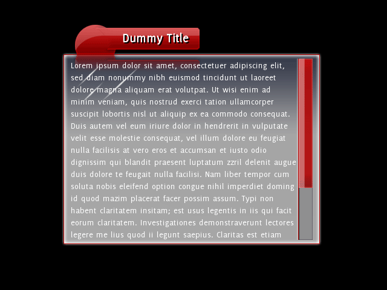
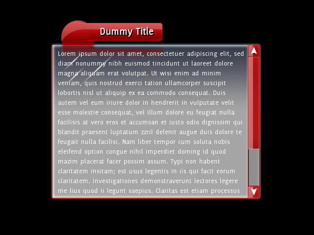

This tutorial will take you step-by-step through the development of the RML and RCSS of the window template we used for _Rocket Invaders from Mars_. By the end of this tutorial you'll be able to create complex, flexible templates for your own application.

To go through this tutorial you'll need an understanding of [RML](../rml.html) and [RCSS](../rcss.html).

### Step 1: Taking a look

Compile the template tutorial (at `/Samples/tutorials/template/`{:.path}) and run the program; you should end up seeing this:



All the the program does is load and show the document defined in `data/tutorial.rml`{:.path}. The RML itself file references `data/tutorial.rcss`{:.path} and `data/tutorial.png`{:.path}. All we're interested in is the RML file and the RCSS file; open them both and take a look.

All we've got to start with in the RML is a simple document with no child elements. It has a class of 'window' which, as you'll see in the RCSS, is what is giving it the glassy background decorator. The style declared in the document's header tag specifies a fixed width and height for the document (so it has some dimensions), and gives it auto margins to centre it within the context. As for the RCSS, we've got nothing more than the a font specification and a tiled-box decorator for drawing the background. And that's it! Simple, but not very useful as a window template yet.

### Step 2: Adding a title bar

We're going to look at adding the title bar first. What we need for this is:

* an element in the top-left of the window
* a horizontal tiling decorator on the element to render the title bar
* a way to set the text on the element so we can procedurally change the title
* a handle on the element so we can drag the window 

#### Defining the title elements

Add a `<div>`{:.tag} element into the body, and give it an ID of `title-bar`{:.value}. The `<div>`{:.tag} is a block-level element, as defined in the base style sheet, so by default it will size itself horizontally to take up the entire length of its parent element, the window. We could put the decorator straight into this element, but then it will be as long as the window; we only want it as long as the title text. So inside the `<div>`{:.tag} element, add a `<span>`{:.tag} element, and give it an ID of `title`{:.value}. Add a dummy title string inside the span, so we can easily get some text up there. By now, you should have this:

```html
<body class="window">
	<div id="title-bar">
		<span id="title">Dummy Title</span>
	</div>
</body>
```

Fire up the application; not much to look at yet, but we'll get there!

The title text is rendering with the body text; we'll need something much bigger and bolder. In the RCSS file, add a new rule for the title span, assigning it a font size of 22, and a weight of bold. And why not a black text shadow while we're here? The rule should look something like this:

```css
div#title-bar span
{
	font-size: 22px;
	font-weight: bold;

	text-shadow: 2px 2px black;
}
```

That looks a bit better, but still no decorator.

#### Setting up the decorator

If you open up the file `tutorial.png`{:.path}., you'll see it contains image information for the title bar (among other things). We'll need to now define the title element's decorator using the texture coordinates from this image. So, in the same rule that you added before, we declare the decorator:

```css
	background-decorator: tiled-horizontal;
```

Then, define the left side of the decorator:

```css
	background-left-image: tutorial.png 147px 0px 229px 85px;
```

Note that all the coordinates are in pixels from the top-left of the image, rather than 0.0 to 1.0; this means that if you have to resize the image later (to fit new elements, icons, etc) you don't have to recalculate all of your decorator coordinates. You can specify texture coordinates directly if you'd like however, just leave off the `px`{:.value} or use the `%`{:.value} sign.

For the centre, we want to stretch the middle pixels on the texture between the left and right sides all the way across.

```css
	background-center-image: tutorial.png stretch 229px 0px 230px 85px;
```

And lastly, the right side:

```css
	background-right-image: tutorial.png 231px 0px 246px 85px;
```

Run the application again and see what we've got.



Well that looks pretty crap! Because the `<span>`{:.tag} element is inline, its height is derived from the height of its content; in this case, the dummy title text. The decorator squishes itself down to fit into the element. We can't throw a height RCSS property in there either, as inline elements (except in a few cases) cannot have their heights set directly. So what do we do? Padding! Margins, padding and borders can all be set on inline elements and, while they don't affect the vertical positioning of the element, they do affect the size of the element and influence the position of child elements. So we can use padding to set the element to the right size and position the text right in the middle of the title bar.

Add some padding along the top of the span to begin with:

```css
	padding-top: 50px;
```

Take a look at the result. The element is now 50 pixels bigger, so the title bar is looking a bit healthier, and the text has been pushed to the bottom of the element. So how big do we need to make the title bar? If you look at the decorator declaration, you can see the title bar image is 85 pixels high. Therefore ideally the element should also be 85 pixels high. So we've got to add padding to get it that high - but how high is it now?

To find out, you can use the debugger; press SHIFT-~ to open the debugging menu. Click on the 'Element Info' button, and then click on the title bar element. The info pane should change to show you a heap of information on the element, including the properties defined on it and their source, dimensions, children and ancestor elements. You can see the height of the element under the 'Position' heading; it work out to be 80px. So, we have to add another 5px of vertical padding.

Set the padding to 55px and take a look; the element should now be 85px high. Now shift some of the padding to the bottom and have a play around to get the text centered. I found the following combination got the text to look in the right place:

```css
	padding-top: 13px;
	padding-bottom: 42px;
```

There's not much space to the left or right of the text yet; easy fixed, just add some left and right padding! We used the following for _Rocket Invaders from Mars_:

```css
	padding-left: 85px;
	padding-right: 25px;
```

But have a play and see what works best. By now the title bar rule should look something like this:

```css
div#title-bar span
{
	padding-left: 85px;
	padding-right: 25px;
	padding-top: 17px;
	padding-bottom: 48px;

	font-size: 22px;
	font-weight: bold;

	text-shadow: 2px 2px black;

	background-decorator: tiled-horizontal;
	background-left-image: tutorial.png 147px 0px 229px 85px;
	background-center-image: tutorial.png stretch 229px 0px 230px 85px;
	background-right-image: tutorial.png 231px 0px 246px 85px;
}
```

And the application should be looking like this:



#### Placing the title bar

As I'm sure you'll have noticed by now, the title bar's in the wrong place! This can be fixed a number of ways, such as negative margins on the containing title element, margins on the body, etc, but we chose to solve it by positioning the title-bar element. To do this, add a new rule for the `title-bar`{:.value} element, declaring it as absolutely positioned.

```css
div#title-bar
{
	position: absolute;
}
```

That in itself won't do much, but now we can play around with its position to the pixel with the `top`{:.attr} and `left`{:.attr} properties.

If you don't set the `top`{:.attr} or `left`{:.attr} (or `right`{:.attr} or `bottom`{:.attr}) to change the height of an absolutely positioned element, it will stay where the layout engine positioned it, but be removed from flow so it will not affect the layout of future elements. If you do change its position, with the `top`{:.attr} property for example, its top edge will be aligned against the top padded edge of its offset parent (in our case, the window), offset by the amount of the property.

We need to shift the element up, so we use the 'top' property to do this. If we declare `top: 0px;`, it will be aligned at the very top of the window; so, exactly where it is now. To move it up, specify a negative number. 40 pixels seems to do the trick.

```css
div#title-bar
{
	position: absolute;
	top: -40px;
}
```

#### Adding a handle

We still need a handle so we can drag the window around. This is easy; {{page.lib_name}} ships with a `<handle>`{:.tag} element that can do just that (or resize an element). In the RML, wrap the contents of the `title-bar`{:.value} element with a `<handle>`{:.tag} element. You can set its move target with the `move_target`{:.attr} attribute; set it to `#document`{:.value} so it knows to move its parent document when it is dragged. You should end up with this:

```html
<div id="title-bar">
	<handle move_target="#document">
		<span id="title">Dummy Title</span>
	</handle>
</div>
```

Now you should be able to drag the window around by holding onto the title. The application should now be looking something like this:



### Step 3: Placing the content

Now we've got a title bar, we need somewhere to place the actual page content. What we're after is:

* an empty block element we can put our page content into
* a vertical scrollbar in case the contents of the page overflow 

Add the block content element now; within the `<body>`{:.tag} tag, just below the `title-bar`{:.value} element. Give it an ID of `content`{:.value} so we can identify it.

```html
	<div id="title-bar">
		<handle move_target="#document">
			<span id="title">Dummy Title</span>
		</handle>
	</div>
	<div id="content">
	</div>
```

Why do we do this, rather than put the content directly into the `<body>`{:.tag} element? When we come to convert this document into a reusable document template, we'll need an empty element that all of a document's content is put into.

Put some dummy content text into the new element and see what we've got.



So we've got a couple of issues already:

* the title bar's reflection is displaying over the content
* the content is rendering outside of the window's border 

#### Using z-index

All elements have a default `z-index`{:.attr} of `0`{:.value}, so normally they would be rendered in the order they are declared in the document. This means elements declared further down in the RML are usually rendered on top of earlier elements. However, floating and positioned elements jump to the front of the queue and are always rendered after normal elements with a similar `z-index`{:.attr}.

So to bring the content window above the title bar, create a new rule for the content element and assign it a `z-index`{:.attr} of `1`{:.value}.

```css
div#content
{
	z-index: 1;
}
```

Much better.

#### Padding the content area

We need to push the document's content area so it appears entirely inside the window border. The decorator we have on the `<body>`{:.tag} element will render over the entire padded area of the element, so if padding is added it will force all content away from the edges of the decorated area.

Add some padding to the `<body>`{:.tag} rule and take a look at the result. We found that 10px top / bottom and 15px right / left padding worked out pretty well. Our rule looks like this:

```css
body.window
{
	background-decorator: tiled-box;
	background-top-left-image: tutorial.png 0px 0px 133px 140px;
	background-top-right-image: tutorial.png 136px 0px 146px 140px;
	background-top-image: tutorial.png stretch 134px 0px 135px 140px;
	background-bottom-left-image: tutorial.png 0px 140px 11px 151px;
	background-bottom-right-image: tutorial.png 136px 140px 146px 151px;
	background-bottom-image: tutorial.png stretch 11px 140px 12px 151px;
	background-left-image: tutorial.png stretch 0px 139px 10px 140px;
	background-center-image: tutorial.png stretch 11px 139px 12px 140px;

	padding: 10px 15px;
}
```

Nice! Now the content's in the right place, but what happens if there's too much to fit? Try that out now by putting more dummy content into the content element.

#### Dealing with overflow

If you open the debugger again and look at the content element, you can see the problem:


We haven't explicitly set the `height`{:.prop} property on the content element, so it defaults to `auto`{:.value}. When calculating the height of a block-level element, `auto`{:.value} means it will grow to fit the content, regardless of the size of its containing element. If we set the `height`{:.prop} property on the content element to `100%`{:.value}, it will force the height to be exactly that of its containing element's content area. Try that and see what we get.

As you can see, the overflow is still showing up. If you open up the debugger and inspect the content element again, you'll see that the element itself is now the right size, but the overflowing text is still visible. How overflow is handled is determined by the `overflow`{:.prop} property; it defaults to `visible`{:.value}, meaning descendant elements are not clipped by the element. Set the 'overflow' property to 'hidden' on the content element; the entire rule for the content element should look like this:

```css
div#content
{
	height: 100%;
	overflow: hidden;

	z-index: 1;
}
```

Take a look at the result; the overflowing content is hidden, but we can't get to it! Time to add a scrollbar.

### Step 4: Adding a scrollbar

To tell {{page.lib_name}} a scrollbar is required on the content element, we can change the `overflow`{:.prop} property from `hidden`{:.value} to either `auto`{:.value} or `scroll`{:.value}. `scroll`{:.value} will put a scrollbar around the element all the time, even if it isn't required; `auto`{:.value} will only put a scrollbar on an axis with overflow.

{{page.lib_name}} also supports different overflow properties per axis, so you can (for example) set vertical overflow to 'scroll' and horizontal overflow to `hidden`{:.value} if you wish.

Change the `overflow`{:.prop} property on the content element to `auto`{:.value} or `scroll`{:.value} and check out the result.



#### Resizing the scrollbar

Well that doesn't look right! So what's happened here? When an element needs to generate a vertical scrollbar, it creates a block-level child element with a tag of 'scrollbarvertical' and anchors it to the right edge of the element. As it is block-level, its width defaults to `auto`{:.value} so it occupies the entire content area of its parent, the content element. So there's no space for the text! Not only that, but we haven't attached a decorator to the scrollbar elements so we can't actually see it yet.

Elements that {{page.lib_name}} dynamically creates, like the scrollbar, can be styled through RCSS like normal elements. All we need to do is create a rule that will match the element `scrollbarvertical`{:.tag}. First thing to do? Set its width so it doesn't occupy the whole element. The scrollbar graphics we've designed for _Rocket Invaders from Mars_ are designed to be 27 pixels wide. This RCSS rule will resize the scrollbar:

```css
scrollbarvertical
{
	width: 27px;
}
```

That's looking a bit better; of course, we can actually see the scrollbar yet, but it is there. You can drag the window up and down if you manage to click in the right place.

#### Decorating the scrollbar

The scrollbar itself has four child elements that can be individually sized and decorated. These are tagged:

* `slidertrack`{:.tag}, the track that runs from the top to the bottom of the scrollbar underneath the bar.
* `sliderbar`{:.tag}, the bar (or knob, thumb, etc) that lies on top of the track and can be dragged up and down.
* `sliderarrowinc`{:.tag}, `sliderarrowdec`{:.tag}, the buttons you can click to move the bar up or down the track. 

We'll start by decorating the track. If you open up `tutorial.png` again, you'll see under the window background there's all the scrollbar images. We'll save you all the hard work, so here's the pixel offsets for the track's decorator:

```css
scrollbarvertical slidertrack
{
	background-decorator: tiled-vertical;
	background-top-image: tutorial.png 56px 199px 83px 201px;
	background-center-image: tutorial.png stretch 56px 201px 83px 202px;
	background-bottom-image: tutorial.png 56px 203px 83px 204px;
}
```

Fire up the application again, and you've got a scrollbar track! As you can see it is lying in the content area of the window, so doesn't yet stretch to the edges like it should; we'll fix that up later.

We've got more vertical decorators to define for the bar element:

```css
scrollbarvertical sliderbar
{
	width: 23px;

	background-decorator: tiled-vertical;
	background-top-image: tutorial.png 56px 152px 79px 175px;
	background-center-image: tutorial.png stretch 56px 175px 79px 175px;
	background-bottom-image: tutorial.png 56px 176px 79px 198px;
}
```

Note that we set the width to 23 pixels, as the image for the bar is only 23 pixels wide. If you take a look at the result, you'll notice the bar is now decorated, but is displaying on top of the border of the track. To be in the right place, we need to move it 4 pixel to the right. How can we do this? With a margin on the left side! Add a four pixel left margin to the 'sliderbar' and it'll be in the right place.

One last thing on the bar; as no height has been explicitly set on the element, the scrollbar will resize it to fit the requirements of the element it is attached to. As the content gets taller or the element gets shorter, the bar will shrink to match. However, we don't want it shrinking below a certain size, as then the image will need to be shrunk and it won't look the best. The smallest size it can display at without shrinking is 46 pixels; you can set the 'min-height' property then to `46px`{:.value} to prevent it from going below that.

Now the window should be looking like this:



#### Adding the arrows

So where are the arrows? If you don't resize them yourself, they'll stay hidden. If we want to add them, first step is resizing them. Add a rule to resize `sliderarrowinc`{:.tag} and `sliderarrowdec`{:.tag} elements to 27 x 24 pixels:

```css
scrollbarvertical sliderarrowdec,
scrollbarvertical sliderarrowinc
{
	width: 27px;
	height: 24px;
}
```

And add decorators to each of them:

```css
scrollbarvertical sliderarrowdec
{
	icon-decorator: image;
	icon-image: tutorial.png 0px 152px 27px 176px;
}

scrollbarvertical sliderarrowinc
{
	icon-decorator: image;
	icon-image: tutorial.png 28px 152px 55px 176px;
}
```

And hey presto, we've got arrows! The scrollbar automatically resizes the slider track to fit the arrows in.

#### Fitting the scrollbar

How do we now resize the scrollbar so it fits in nicely with the window? We can give the scrollbar element itself negative margins, which cause it to push outside of its parent's content area. If you take a take a screenshot of the application and paste it into your paint program, you can see exactly how many pixels it needs to be shifted to the right, and extended on the top and bottom. We worked out 6 pixels up and down, 11 pixels to the left. Add these properties as negative margins to the `scrollbarvertical`{:.tag} rule:

```css
scrollbarvertical
{
	width: 27px;
	margin-top: -6px;
	margin-bottom: -6px;
	margin-right: -11px;
}
```

And from that we've got:



#### Adding hover and click decoration

Now the scrollbar is functional, but there's no extra decoration for clicks and mouse-overs. You can add these in easily by changing the texture coordinates on the decorations for the :hover and :active pseudo-classes. For example, add the following rule to put in hover decoration on the bar:

```css
scrollbarvertical sliderbar:hover
{
	background-top-image-s: 80px 103px;
	background-center-image-s: 80px 103px;
	background-bottom-image-s: 80px 103px;
}
```

### Step 5: Templating the document

Now we've got a complete window document. But what we really want is a window template, so we can easily create new documents that reuse the layout.
Creating the template

Make a copy of the RML file and call it `template.rml`. To change it from a document into a template, change the top `<rml>`{:.tag} tag to `<template>`{:.tag}. The `<template>`{:.tag} tag needs a couple of bits of information; the name of the template, set by the `name`{:.attr} attribute, and the ID of the element where the document's content should go, set by the 'content' attribute. The final tag should look like:

```html
<template name="window" content="content">
```

Delete the title and the style declaration in the template header; we won't need those. Also remove the contents of the content element. You should end up with a template file looking like this:

```html
<template name="window" content="content">
<head>
	<link type="text/css" href="../../assets/rkt.rcss"/>
	<link type="text/css" href="tutorial.rcss"/>
</head>
<body class="window">
	<div id="title-bar">
		<handle move_target="#document">
			<span id="title">Dummy Title</span>
		</handle>
	</div>
	<div id="content">
	</div>
</body>
</template>
```

Adapting the document

Now we want to change the document we've been working on to use the new template. Open the `tutorial.rml`{:.path} file.

The link to the RCSS file is no longer required, as the template will load it. So that should go. However, we need to add another link to the template. Add a new link of type `text/template`{:.value}, with the href pointing to `template.rml`{:.path}.

Both the title and style declaration stay; these are unique to this document.

The `<body>`{:.tag} tag needs to be changed so it knows which template to inject itself into. Do this with the `template`{:.attr} attribute, and set it to the name of the template. In our case, we called the template `window`{:.value}. Now delete the window elements inside the 'body' element, except for the actual content. You should end up with something like this:

```html
<rml>
<head>
	<link type="text/template" href="template.rml"/>
	<title>Window</title>
	<style>
		body
		{
			width: 400px;
			height: 300px;

			margin: auto;
		}
	</style>
</head>
<body template="window">
	Lorem ipsum dolor sit amet, consectetuer adipiscing elit, sed diam nonummy nibh euismod tincidunt ut laoreet dolore magna aliquam erat volutpat.
</body>
</rml>
```

And we're done. When the document is loaded, it will load the template and inject the contents of its `<body>`{:.tag} into the `content`{:.tag} element of the template. Any new windows you make can use the same template. If you ever want to reskin your window, or maybe design an entirely new one, you only have to alter the template file!

### Step 6: Setting the title

We still have one last thing to implement; the title of the document isn't set on the title bar. We'll show you how to do this through the C++ API, but you can also easily do this through a scripting interface.

The document is loaded on line 68 of main.cpp. Before the document is rendered, we want to get the `<span>`{:.tag} element containing the dummy title and set its inner RML content to the title of the document we just loaded. To fetch the element, call the `GetElementById()`. Once you have the element, you can remove all of its children and set new RML content with `SetInnerRML()`. The document itself has the `GetTitle()` function to fetch the title.

```cpp
	// Load and show the tutorial document.
	{{page.lib_ns}}::Core::ElementDocument* document = context->LoadDocument("data/tutorial.rml");
	if (document != NULL)
	{
		document->GetElementById("title")->SetInnerRML(document->GetTitle());
		document->Show();
	}
```

In a real-world application, you can automate this by putting a `onload`{:.evt} event into the document template and setting the title in the event handler. 
